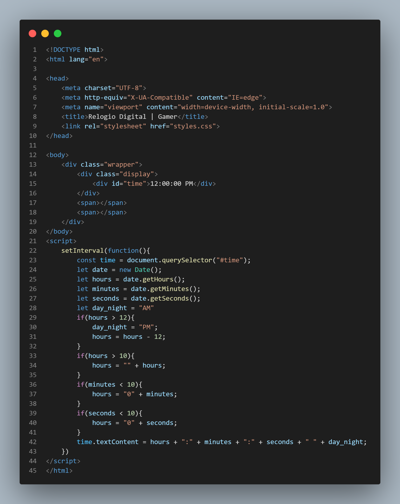

   

ÍNDICE...

<a href="#sobre-o-projeto">Sobre</a> • 
<a href="#Imagens-do-projeto">Imagens do projeto</a> • 
<a href="#Tecnologias--">Tecnologias</a> • 
<a href="#Ferramentas">Ferramentas</a>

<h1 align="center">Sobre o Projeto</h1>

<h3 align="center">Relogio_Digital-Gamer</h3>

<h4 align="center">Um relógio visual em HTML, CSS e JavaScript com retro iluminação em RGB em seu aro em volta do relógio.</h4> 

---------------------------------------------------------------------------------------------------------------------------------

<h1 align="center">Imagens do projeto</h1>

<h3 align="center">Imagem do Funcionamento   
   
</h3>
<h3 align="center">HTML do Relogio   
   
</h3>

<h3 align="center">CSS do Relogio   
   
</h3>

